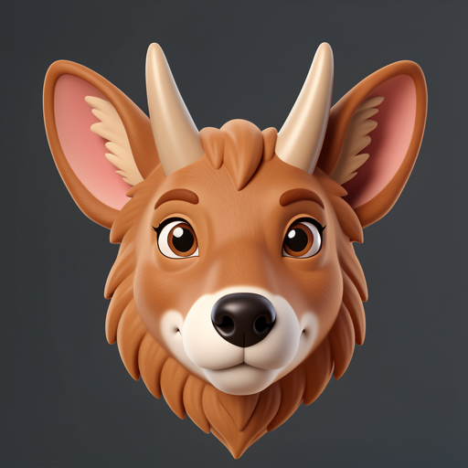
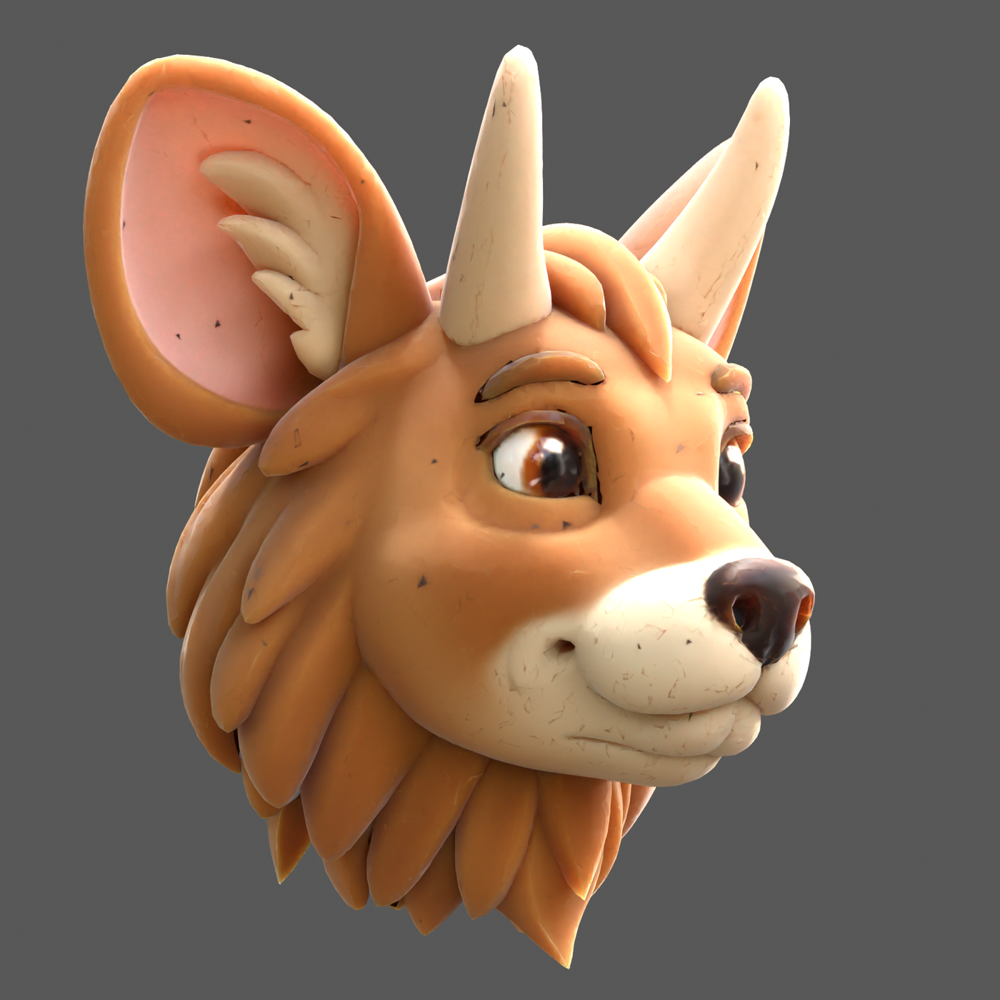

# trellis2mlx

MLX-native [TRELLIS.2](https://github.com/microsoft/TRELLIS.2) inference and
cross-runtime causal forensics for Apple Silicon.

Run [TRELLIS.2](https://github.com/microsoft/TRELLIS.2) 3D generation on Mac
using [MLX](https://github.com/ml-explore/mlx). No NVIDIA GPU required. The
end-to-end route includes native MLX DINOv3 conditioning, sparse/shape/texture
flows, mesh extraction, simplification, UV unwrap, texture baking, PBR
materials, and GLB export.

> **Status:** the public `main` branch is a working technical preview. The
> published research branch adds hash-bound CUDA/MPS/MLX replay and finalization
> experiments. Output quality is still input-sensitive, and exact end-to-end
> CUDA parity is not claimed.

## Research result: coherent full MLX product

<table>
<tr>
<td></td>
<td></td>
<td></td>
</tr>
<tr>
<td align="center"><em>Input</em></td>
<td align="center"><em>MLX result, front</em></td>
<td align="center"><em>MLX result, oblique</em></td>
</tr>
</table>

These are Blender/Cycles beauty renders of one MLX-generated GLB from the
[`cc/pixal9-capture-contract-r9-0821`](https://github.com/lyonsno/trellis2mlx/tree/cc/pixal9-capture-contract-r9-0821)
research route at commit
[`e1d987d`](https://github.com/lyonsno/trellis2mlx/commit/e1d987d12c9dc3ed668af5f96d0d525a801bdb6f):
seed 81414, 512 resolution, 8 steps, no cascade, 100K target faces, 512 texture,
and source-ordered cleanup. The exact product completed in 158.4 seconds on the
measured M4 Max route.

Cycles lighting and subsurface-scattering treatment improve presentation in
these witnesses; the geometry and baked textures come from the recorded GLB.

The result is visually strong, but it is not presented as topology-perfect.
Localized one-sided failures remain around finely articulated crevices, and the
rear hair/horn regions retain texture smearing. The case settings, measurements,
asset hashes, and limitations are preserved in the
[`feature-animation-81412` manifest](docs/research/feature-animation-81412.json).

## What the port uncovered

Finishing the port exposed a more interesting systems problem than raw feature
parity:

1. **The backend authority map matters.** A frozen CUDA witness aligned more
   closely with MLX/CPU than with PyTorch MPS, so copying the existing Mac port's
   discrepancy would have moved MLX away from source behavior.
2. **Local correctness is contextual.** Source-correct tensors could still
   cross a different decoded separatrix when inserted into the wrong residual
   neighborhood; residual-complete joins could recover the source continuation
   exactly.
3. **Inference and finalization are separate causal surfaces.** Semantically
   coherent raw MLX geometry could be damaged or rescued by cleanup order, while
   a six-case replay showed that neither cleanup order wins globally.

[Read the compact cross-runtime causal-forensics case study →](docs/cross-runtime-causal-forensics.md)

Claim boundary: this is the first fully working MLX-native end-to-end TRELLIS.2
pipeline we know of, validated locally on Apple Silicon with native DINO
conditioning and coherent textured GLB output. It is not a claim to be the first
TRELLIS.2 project on Mac, nor a claim that every MLX seed reproduces source CUDA.

## Validation snapshot

Validated end-to-end on Apple Silicon:

| Machine | OS | Result | Wall time | Peak RSS |
|---|---|---|---:|---:|
| M2 Pro, 16 GB | macOS 26.5.1 / Tahoe | Coherent textured GLB from `assets/shoe_input.png` | 21m05s | 6.75 GB |
| M4 Max, 128 GB | macOS | Full textured shoe pipeline | ~8.6 min | ~5 GB during decode |

See [docs/validation.md](docs/validation.md) for recorded commands, artifact hashes, structural GLB inspection, and the GLB witness renderer.

The M2 Pro run is the hardware proof: native MLX DINOv3 features, full TRELLIS.2 cascade, textured GLB export, structural GLB inspection, and visually inspected coherent output. Hero images and demos may use the best Apple Silicon output available, but hardware provenance should be labeled honestly.

Claim boundary:

> The first fully working MLX-native end-to-end TRELLIS.2 pipeline we know of: native DINO conditioning, sparse/shape/texture stages, mesh extraction, texture bake, and coherent textured GLB output locally on Apple Silicon, validated on a 16 GB M2 Pro.

This is not a claim to be the first TRELLIS.2 project on Mac. [trellis-mac](https://github.com/shivampkumar/trellis-mac) proved the important prior Mac viability path via PyTorch MPS and should be credited.

## What works now

Full pipeline: image → textured GLB with PBR materials.

```bash
# Full pipeline (two-pass cascade, high quality):
PYTHONPATH=. python generate.py --image photo.png --output mesh.glb

# Visual preview (single-pass, 8 steps; preserves objectness much better than 4-step plumbing checks):
PYTHONPATH=. python generate.py --image photo.png --output mesh.glb --steps 8 --no-cascade --target-faces 100000 --texture-size 512

# Premium preview texture (same geometry setting, nicer shaded inspection):
PYTHONPATH=. python generate.py --image photo.png --output mesh.glb --steps 8 --no-cascade --target-faces 100000 --texture-size 4096

# Higher quality mesh topology (Metal-accelerated QEM simplification):
PYTHONPATH=. python generate.py --image photo.png --output mesh.glb --qem-simplify

# Stage 1+2 only (fast preview, colored voxels):
PYTHONPATH=. python smoke_stage2.py --image photo.png
```

The pipeline uses a two-pass architecture matching the TRELLIS.2 reference:
1. **Image conditioning** — native MLX DINOv3 ViT-L/16 features
2. **Sparse Structure** — SparseStructureFlowModel (1.29B params) + decoder -> 64³ occupancy grid
3. **LR Shape Latent** — SLatFlowModel (1.29B params) on sparse tokens
4. **Upsample** — decoder subdivision predictions -> high-res coordinate structure
5. **HR Shape Latent** — SLatFlowModel again at 1024 cascade resolution
6. **Shape decode + mesh extraction** — sparse UNet decoder -> `flexible_dual_grid_to_mesh`
7. **Texture SLat + decode** — per-voxel PBR attributes
8. **UV unwrap + bake** — xatlas unwrap (`max_iterations=0`), MLX Metal rasterizer, trilinear voxel sampling, seam inpaint, GLB export

### Preview vs final-quality modes

The cheapest route that exits successfully is not necessarily a useful visual
preview. In a 2026-06-27 M4 Max matrix on an isolated mechanical object, 4-step
no-cascade output finished quickly but produced a shredded false baseline, while
8-step no-cascade preserved the object envelope well enough for candidate triage.
Treat these numbers as a starting heuristic rather than a machine-independent
benchmark; Apple Silicon timing is sensitive to thermal state and other GPU work.

| Mode | Command shape | Measured total | Use |
|---|---|---:|---|
| Plumbing check | `--steps 4 --no-cascade --target-faces 100000 --texture-size 512` | ~62s | Route smoke only; do not judge visual quality from this. |
| Recommended preview | `--steps 8 --no-cascade --target-faces 100000 --texture-size 512` | ~187s | Default search/triage mode; good objectness/cost balance in the measured matrix. |
| Premium preview | `--steps 8 --no-cascade --target-faces 100000 --texture-size 4096` | texture bake +~22-24s measured; wall-clock noisy | Same geometry as preview, better shaded viewport/readback. Use after shape passes. |
| No-cascade higher step | `--steps 10/12 --no-cascade --target-faces 100000 --texture-size 512` | ~296-347s in matrix | More expensive; not clearly better than 8-step for preview on the measured input. |
| Full/final | default cascade, `--target-faces 200000 --texture-size 4096` | ~6-9 min on M4 Max-class runs | Final-quality smoke; best objectness and texture read, not a cheap search mode. |

Texture-size note: in the 8-step no-cascade comparison, `texture-size=512` and
`texture-size=4096` produced identical geometry (120,947 vertices / 107,216
faces). The 4k texture raised GLB size from ~5.9 MB to ~34.8 MB and improved
surface sampling, but did not materially change the yes/no coherence decision in
the deterministic witness. Use 512 during search and reserve 4096 for premium
preview or final presentation.

### Performance: M2 Pro validation run

Full native-DINO shoe run on M2 Pro / 16 GB / macOS 26.5.1:

```bash
PYTHONPATH=. python generate.py --image assets/shoe_input.png --output /tmp/trellis2mlx-tahoe-shoe-full-native.glb
```

| Stage | Time | Notes |
|-------|------|-------|
| Native DINOv3 | loaded 412 arrays | features `(1, 1029, 1024)` |
| Sparse structure | 116.9s | 2,977 sparse voxels |
| LR SLat | 80.0s | 2,977 tokens |
| Upsample -> HR coords | 15.6s | 761,916 voxels, 12,043 HR tokens |
| HR SLat | 518.0s | 12,043 tokens |
| Shape decode | 63.2s | 3,040,506 voxels |
| Mesh extraction + simplify | 6.0s | 6,016,550 raw faces -> 199,999 faces |
| Texture SLat | 290.6s | 12,043 tokens |
| Texture decode | 60.1s | 6-channel PBR |
| UV unwrap + texture bake | 97.9s | unwrap, raster, voxel sample, seam inpaint |
| **Total** | **1264.4s** | 1265.04s wall-clock |

Output artifact from that run:

- GLB: `/tmp/trellis2mlx-tahoe-shoe-full-native.glb`
- SHA256: `608f1c3487a02b3545c8d54b4f02fedaa7deb5dd736c0020129e1a86a1033882`
- Structure: 264,350 vertices, 199,999 faces, `TextureVisuals`, `PBRMaterial`, base color texture present
- Visual result: recognizable red shoe with white swoosh/upper structure, plus expected single-image reconstruction debris and red background fragments

### Performance: M4 Max reference run

| Stage | Time | Notes |
|-------|------|-------|
| Sparse structure (12 steps) | ~34s | 1.29B param DiT on 16³ grid |
| LR SLat (1.7K tokens, 12 steps) | ~14s | |
| Upsample → HR coords | ~6s | 463K voxels |
| HR SLat (7.2K tokens, 12 steps) | ~2 min | 1024 cascade model |
| Shape decode (1.9M voxels) | ~73s | 474M param sparse UNet |
| Mesh extraction + simplify | ~3s | 3.7M → 200K faces |
| Texture SLat (7.2K tokens, 12 steps) | ~1.3 min | No CFG (single pass) |
| Texture decode (1.9M voxels) | ~29s | 6-channel PBR |
| UV unwrap + texture bake | ~2.2 min | xatlas + trilinear sample |
| **Total** | **~8.6 min** | |

Peak memory: ~3 GB for SLat flow, ~5 GB during decode on the M4 Max reference path.

[trellis-mac](https://github.com/shivampkumar/trellis-mac) proved TRELLIS.2 viability on Mac via PyTorch MPS. This MLX rewrite targets lower memory (~3-5 GB vs 40-55 GB) and faster inference by using MLX's native Flash Attention and Apple Silicon memory architecture.

### Parity and quality status

Native MLX model components track a same-weight PyTorch comparator closely in
direct checks, but that historical comparator is not a universal source
authority. CUDA, PyTorch MPS, CPU, and MLX can form different numerical islands;
on a frozen block-7 witness, source CUDA was materially closer to MLX/CPU than to
PyTorch MPS. Treat the current release as a working end-to-end MLX pipeline, not
a promise that every seed/input matches source CUDA or another Mac route
visually.

Historical 12-step same-weight, same-noise PyTorch comparator:

| Step | Correlation | Max diff |
|------|-------------|----------|
| 1 | 0.999999 | 0.009 |
| 3 | 0.999991 | 0.020 |
| 6 | 0.999938 | 0.051 |
| 9 | 0.998852 | 0.434 |
| 12 | 0.968466 | 2.128 |

These measurements remain useful, but the old conclusion that the entire
divergence was monotonic BF16-to-FP16 accumulation was too strong. Controlled
replays now show both smooth accumulation and discrete basin changes. Raw mesh,
cleanup order, simplification, UV processing, and texture bake are tracked as
separate causal surfaces. See
[`docs/cross-runtime-causal-forensics.md`](docs/cross-runtime-causal-forensics.md)
for the current evidence and claim boundary.

### Quantization (experimental)

`generate.py --quantize 4` uses MLX INT4 quantization on the four flow models
(sparse structure, LR shape SLat, HR shape SLat, and texture SLat). This reduces
flow-model weight memory by about 6.4x, which is useful for packaging and tighter memory
budgets, but there was no speedup on the measured M2 Pro route.

| | FP16 | INT4 |
|---|---|---|
| Weight memory | 5.17 GB | 0.81 GB |
| Forward pass | works | works |

M2 Pro / MLX 0.31.2 stage benchmark, one warmup step plus two timed sampler
steps:

| Stage | FP16 | INT8 | INT4 |
|---|---:|---:|---:|
| Sparse-structure flow, 16³ grid | 9.56s/step | 10.62s/step | 10.70s/step |
| SLat flow, 12,043 tokens | 47.57s/step | 49.94s/step | 52.35s/step |

So the current tradeoff is memory/packaging only: INT8 and INT4 were slower than
FP16 in this benchmark. Further speedups likely need fewer sampler steps,
stage/model reuse, batching, or fused kernels rather than weight-only
quantization.

To rerun the flow-stage benchmark:

```bash
PYTHONPATH=. python scripts/bench_quantization.py \
  --image assets/shoe_input.png \
  --variants fp16,int8,int4 \
  --stages ss-flow,slat-flow
```

The table above was recorded before the reusable harness was committed. The command
reruns the same sparse flow plus synthetic 512-shape-SLat stress benchmark for
future reports; it is not a full four-flow `generate.py --quantize` rerun.

The script writes an incremental JSON report and records the effective repo
head, checkpoint files, host/MLX identity, asset route, variants, stages, and
failure phase if the run stops early.

### Roadmap

- [x] SparseStructureFlowModel (1.29B param DiT) — numerically verified
- [x] SparseStructureDecoder (73.7M param Conv U-Net)
- [x] SLatFlowModel (1.29B param sparse token DiT)
- [x] ShapeSLatDecoder (474M param sparse UNet)
- [x] Two-pass architecture (LR SLat → upsample → HR SLat → decode)
- [x] `flexible_dual_grid_to_mesh` mesh extraction
- [x] SLat denormalization (pipeline.json mean/std)
- [x] Weight loading (640/640 + 74/74 + 640/640 + 292/292 params)
- [x] Flow Euler sampler with CFG + guidance interval + rescale
- [x] 3D RoPE position embedding (dynamic, computed from input shape)
- [x] Image conditioning via DINOv3 (native MLX — no PyTorch required)
- [x] MLX Flash Attention (`mx.fast.scaled_dot_product_attention`)
- [x] Periodic eval to prevent memory bus starvation
- [x] INT4 quantization utility
- [x] Historical 12-step same-noise PyTorch comparator recorded
- [x] CUDA/MPS/MLX authority split established with frozen witnesses and controlled replay
- [x] Mesh simplification via fast-simplification (3.7M → 200K faces in ~1s)
- [x] Metal-accelerated QEM mesh simplification (`--qem-simplify`) — topology-preserving edge collapse with normal-flip guard, adapted from [mtlmesh](https://github.com/pedronaugusto/trellis2-apple)
- [x] Texture SLat flow + decoder → per-voxel PBR attributes
- [x] UV unwrap (xatlas, `max_iterations=0`) + GPU texture baking (MLX Metal rasterizer + trilinear sample + cv2 inpaint)
- [x] xatlas chart optimization bypass: 56x faster UV unwrap, <1% quality difference ([docs/uv-unwrap.md](docs/uv-unwrap.md))
- [x] Full pipeline: image → textured GLB with PBR materials (~8.6 min)
- [x] 1024 cascade architecture (LR 512 model + HR 1024 model)
- [x] `--no-cascade` + `--steps` flags for speed/quality control (4-step route smoke, 8-step visual preview)
- [x] Cross-attention KV cache (eliminates redundant KV projection across ODE steps)
- [x] Sparse conv neighbor map caching (313x cache hit speedup)
- [x] M2 Pro / macOS 26 full native-DINO smoke (21m05s, 6.75 GB peak RSS)
- [ ] Public demo polish and seed/input curation
- [x] M2 Pro INT4/INT8 flow-stage speed benchmark (no speedup measured)
- [x] `mx.compile` investigation (no speedup — eager dispatch is already optimal for 30-block DiT)
- [ ] Native macOS/iOS app (PyObjC/SwiftUI shell first, MLX Swift route later)

## Why MLX

[trellis-mac](https://github.com/shivampkumar/trellis-mac) demonstrated that TRELLIS.2 can run on Mac via PyTorch MPS, and [trellis2-apple](https://github.com/pedronaugusto/trellis2-apple) contributed Metal modules for the ecosystem. This project rewrites the inference stack in MLX to take full advantage of Apple Silicon:

- **Memory:** MLX's SDPA is real Flash Attention — O(N) memory vs O(N²) for MPS SDPA. Handles 262K tokens at ~3 GB instead of 275 GB.
- **Accessibility:** Validated on a 16 GB M2 Pro as well as an M4 Max; designed for Apple Silicon rather than CUDA-only workstations.
- **Bus-friendly:** Periodic eval yields memory bus between GPU bursts, preventing beachballs during generation.
- **No PyTorch:** Fully native MLX pipeline including DINOv3 image conditioning. No torch/torchvision/transformers dependency.

## Quick start

```bash
git clone https://github.com/lyonsno/trellis2mlx.git
cd trellis2mlx
uv venv .venv --python python3.11
source .venv/bin/activate
uv pip install -e .

# Hugging Face auth (needed for gated DINOv3 weights):
hf auth login
# Request access: https://huggingface.co/facebook/dinov3-vitl16-pretrain-lvd1689m

# Download model weights (~5 GB total):
hf download microsoft/TRELLIS.2-4B
hf download microsoft/TRELLIS-image-large
hf download facebook/dinov3-vitl16-pretrain-lvd1689m

# Full pipeline (image → textured mesh):
PYTHONPATH=. python generate.py --image your_image.png

# Quick preview (stages 1+2 only, no texture):
PYTHONPATH=. python smoke_stage2.py

open /tmp/trellis-mlx-mesh.glb
```

Without `--image`, runs with random conditioning (abstract shapes, useful for verifying the pipeline works without downloading DINOv3 weights).

## Tests

```bash
uv run --with pytest python -m pytest tests/ -v
```

Test suite covers core modules, onboarding contracts, and witness renderer behavior.

## Architecture

See [docs/architecture-map.md](docs/architecture-map.md) for the full TRELLIS.2-4B architecture reference.

```
trellmlx/
├── models/
│   ├── sparse_structure_flow.py   # 1.29B param DiT (30 blocks, 3D RoPE, adaLN-Zero)
│   ├── sparse_structure_decoder.py # 73.7M param Conv3d U-Net (pixel shuffle upsample)
│   ├── slat_flow.py               # 1.29B param sparse token DiT (shape detail)
│   └── shape_slat_decoder.py      # 474M param sparse UNet (Channel2Spatial upsample)
├── modules/
│   ├── attention.py               # mx.fast.scaled_dot_product_attention + MultiHeadRMSNorm
│   ├── rope.py                    # 3D Rotary Position Embedding
│   ├── norm.py                    # LayerNorm32 (fp32 accumulation)
│   └── sparse_conv.py             # Submanifold sparse 3D convolution (gather-scatter)
├── mesh_extract.py                # flexible_dual_grid_to_mesh (numpy)
├── samplers.py                    # Flow Euler sampler with CFG + guidance interval
├── weight_loader.py               # Checkpoint loading (key remap, Conv3d permute, bf16/fp16)
└── quantize.py                    # INT4/INT8 quantization utility
```

## Credits

- [TRELLIS.2](https://github.com/microsoft/TRELLIS.2) by Microsoft Research — the model
- [trellis-mac](https://github.com/shivampkumar/trellis-mac) by Shivam Kumar — proved Mac viability
- [trellis2-apple](https://github.com/pedronaugusto/trellis2-apple) by Pedro Naugusto — Metal modules
- [MLX](https://github.com/ml-explore/mlx) by Apple — the framework

## License

MIT (porting code). Upstream model weights are subject to their own licenses — see [trellis-mac](https://github.com/shivampkumar/trellis-mac#license) for details.
