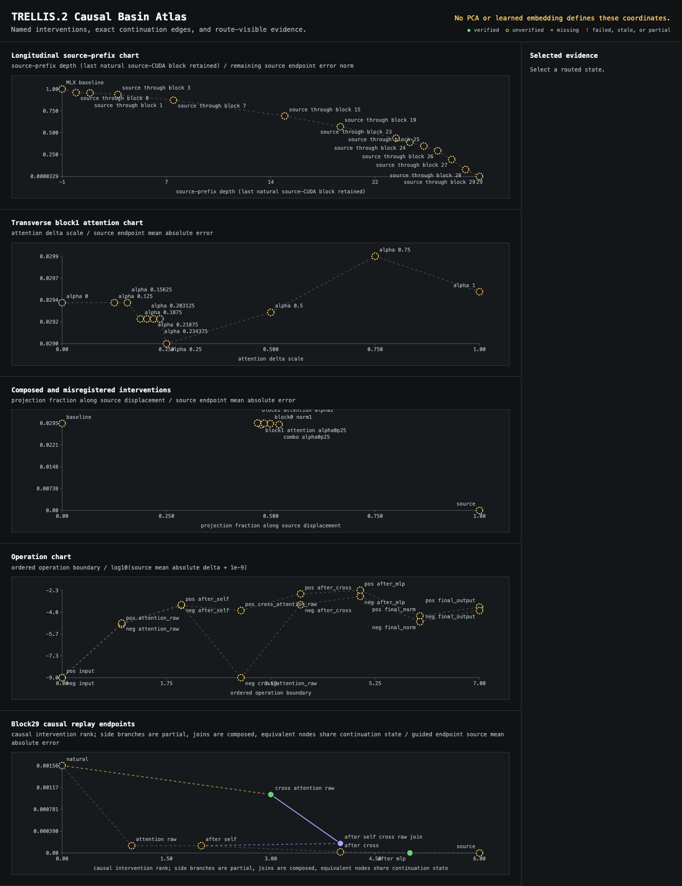

# Cross-runtime causal forensics

`trellis2mlx` began as an Apple Silicon port of TRELLIS.2. Reaching a working
end-to-end pipeline exposed a harder problem: a port can agree closely with a
reference at isolated checkpoints and still settle into a different decoded
object after recurrent flow sampling, mesh extraction, and cleanup.

This note records the strongest public conclusions from the ongoing
investigation. It is deliberately narrower than a claim of end-to-end CUDA
parity.

## Authority map

The investigation treats three routes as separate authorities rather than
collapsing every PyTorch result into "the reference":

| Route | Role | What it can establish |
|---|---|---|
| Microsoft TRELLIS.2 on NVIDIA CUDA | Source implementation | Source behavior for a frozen witness or complete decode |
| `trellis-mac` on PyTorch MPS | Independent Mac comparator | Whether a discrepancy is shared by another Apple backend |
| `trellis2mlx` on MLX | Candidate port | Whether the MLX implementation reproduces the intended computation and product |

That distinction mattered immediately. In one frozen block-7 witness, CUDA was
closer to the MLX/CPU numerical island than to PyTorch MPS:

| Witness | CUDA vs PyTorch MPS | CUDA vs MLX fast |
|---|---:|---:|
| K projection output, mean absolute error | `4.56e-08` | `8.96e-09` |
| K projection output, nonzero elements | 15 | 5 |
| Raw attention, mean absolute error | `2.06e-07` | `4.80e-11` |
| Raw attention, nonzero elements | 46,455 | 75 |

The earlier MPS discrepancy was real, but copying it into MLX would have moved
the port away from source CUDA. Source inspection explained the split: the MPS
route used a variance formulation different from the CUDA/CPU Welford path.

## The decoded object is a dynamical result

Direct tensor similarity was not sufficient to predict the final object. The
flow model repeatedly feeds its current state through the network, so a small
local change can alter the residual neighborhood seen by every later block and
step.

Controlled replay established three different behaviors:

1. Replacing a growing **source prefix** generally moved the continuation
   monotonically toward the source result.
2. Injecting a locally source-correct tensor into the wrong residual
   neighborhood could produce a discrete, non-monotonic basin jump.
3. At block 29, joining source `after_self` with source raw cross-attention
   reconstructed source `after_cross` bit-for-bit. The next MLX MLP could then
   become the new divergence point.

This is why the investigation is organized as a causal intervention graph, not
as a PCA or UMAP of latent vectors. The useful geometry is defined by which
interventions cross a decoded separatrix, which prefixes preserve a basin, and
which residual-complete joins recover the source continuation.

The atlas is an investigation instrument, not a claim that two-dimensional
distance faithfully represents the model's latent space. It records
longitudinal source prefixes, transverse perturbations, operation-level joins,
and the decoded outcomes they caused.

## Inference and finalization are separate causal surfaces

A friendly feature-animation control made the boundary unusually clear:

- PyTorch MPS raw extraction: 3,131,410 faces.
- MLX raw extraction: 2,197,170 faces, about 29.84% fewer.
- The MLX raw object was semantically coherent and occupied a different, slightly
  weaker basin, but did not exhibit the catastrophic final-output pathology.
- A source-ordered cleanup route produced the first strongly coherent
  approximately 100K-face MLX product for this case and survived UV unwrap,
  texture decoding, PBR bake, and GLB export.
- Localized one-sided failures and rear hair/horn texture smearing remained.

The exact product completed in 158.4 seconds on the measured M4 Max route. Its
settings and promoted asset hashes are recorded in
[`research/feature-animation-81412.json`](research/feature-animation-81412.json).

This does not make source-ordered cleanup a universal fix. A fixed six-case
replay found an input-dependent interaction between raw topology and cleanup
order. On one difficult case, source cleanup removed 286,168 faces and still
left holes. The supported conclusion is narrower: downstream finalization can
amplify or transform an upstream basin difference, and cleanup policy must be
evaluated against the raw topology it consumes.

## A second discriminator: simplifier objectives

Five simplifier routes were compared on the same 1,409,853-face source mesh:

- 195,957 source faces survived every route.
- 1,197,834 survived none.
- Only 16,062 survived a strict subset of routes.
- 92.4% of faces retained by any route were retained by all five.
- Pairwise survivor-set Jaccard similarity ranged from 0.954 to 0.980.

That evidence argues against backend arithmetic or route-specific face picking
as the main explanation for lost hair detail. The more promising variable is
the simplifier's preservation objective: which geometric structures its error
metric values before it reaches the target face count.

## Current claim boundary

The public evidence supports all of the following:

- A fully MLX-native TRELLIS.2 route runs end to end on Apple Silicon.
- CUDA, PyTorch MPS, CPU, and MLX cannot be treated as one interchangeable
  numerical reference.
- Tiny local discrepancies can be causally amplified by recurrent flow
  sampling, but not every visible defect originates in inference.
- Raw geometry, cleanup order, simplification, UV processing, and texture bake
  are independently testable causal surfaces.
- At least one research-branch MLX result is visually strong through the full
  textured GLB product.

It does **not** yet support these stronger claims:

- end-to-end visual or tensor parity with source CUDA for arbitrary inputs;
- globally correct one-sided topology;
- a cleanup route that dominates across the input distribution;
- promotion of every research-branch diagnostic or cleanup selector to public
  `main`.

The featured README result is therefore labeled as a research-branch result,
with its remaining one-sided and texture limitations stated beside it. The next
proof surface can build directly on the case manifest and intervention atlas:
raw mesh, waist checkpoint, final GLB, and source/MLX continuations can become
linked interactive stages without changing the evidence model used here.
